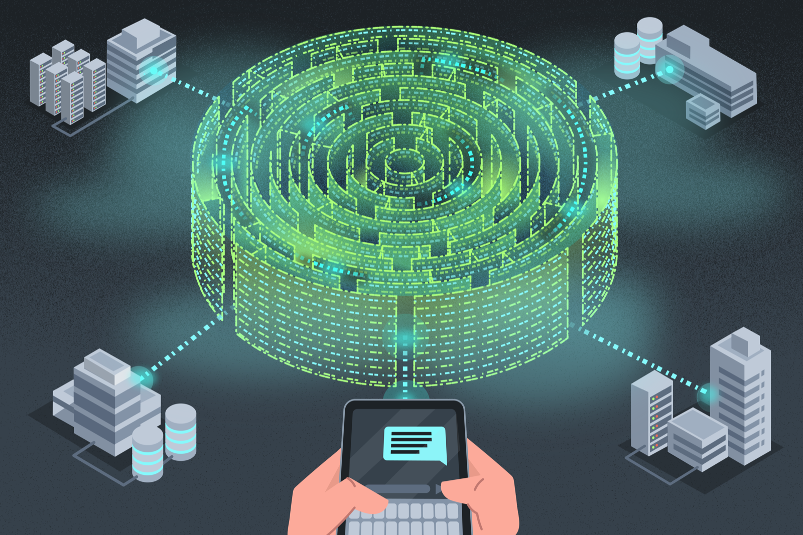
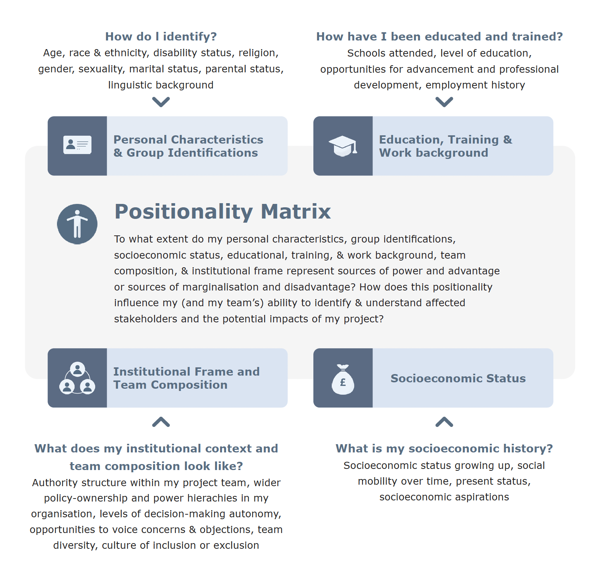

# Reflect on Purpose, Positionality and Power

<figure markdown>
  { align="center" }
</figure>

Another crucial element of responsible research and innovation in AI supposes that the people who design, develop, and deploy a system engage in reflexive practices that scrutinise the way potential perspectival limitations and power imbalances can exercise influence on the equity and integrity projects and on the motivations, interests, and aims that steer them. 

The imperative of reflecting on purposes, positionality, power makes explicit the importance of this dimension of inward-facing reflection. This is a complement to the more outward-facing activities of stakeholder analysis, engagement, and impact assessment. 

As we have already discussed, all individual human beings come from unique places, experiences, and life contexts that shape their perspectives, motivations, and purposes. Reflecting on these contextual attributes is important insofar as it can help team members understand how their viewpoints might differ from those around them and, more importantly, from those who have diverging cultural and socioeconomic backgrounds and life experiences. 

Identifying and probing these differences enables individual team members to better understand how their own backgrounds, for better or worse, frame the way they see others, the way they approach and solve problems, and the way they carry out research and engage in innovation. By undertaking such efforts to recognise social position and differential privilege, they may gain a greater awareness of their own personal biases and unconscious assumptions. This then can enable them to better discern the origins of these biases and assumptions and to confront and challenge them in turn.

Social scientists have long referred to this site of self-locating reflection as “positionality”.[@bourke2014]-[@kezar2002]-[@merriam2001] When people take their own positionalities into account, and make this explicit, they can better grasp how the influence of their respective social and cultural positions potentially creates research strengths and limitations. On the one hand, one’s positionality—with respect to characteristics like  ethnicity, race, age, gender, socioeconomic status, education and training levels, values, geographical background, etc.—can have a positive effect on an individual’s contributions to a project; the uniqueness of each person’s lived experience and standpoint can play a constructive role in introducing insights and understandings that other team members do not have. On the other hand, one’s positionality can assume a harmful role when hidden biases and prejudices that derive from a person’s background, and from differential privileges and power imbalances, creep into decision-making processes undetected and subconsciously sway the purposes, trajectories, and approaches of projects.

When taking positionality into account, team members should reflect on their own positionality matrix. They should ask: To what extent do my personal characteristics, group identifications, socioeconomic status, educational, training, & work background, team composition, & institutional frame represent sources of power and advantage or sources of marginalisation and disadvantage? How does this positionality influence the team's ability to identify & understand affected stakeholders and the potential impacts of the project? Answering these questions involves probing several other areas of self-ascription related to each researcher’s contextual attributes:

<figure markdown>
  { align="center" }
</figure>

A solid grasp on positionality allows team members to better interrogate and reflect on the power dynamics that could unduly influence research purposes and trajectories. Such reflections on power should involve an investigation of how power operates, and where it manifests, both across the  project lifecycle and in the real-world environments the project is situated. Leslie et al., propose a series of guiding questions that can be used as a reflective tool to help make potentially noxious power dynamics explicit:[@lesliedavid2022]

- What, if any, power imbalances exist between me (or my team) and the communities impacted by our project?

- Do the projects I currently pursue reinforce or challenge these imbalances?

- How, if at all, do these imbalances result in unjust exercises of power? 

- Are my current activities entrenching or combating such exercises of power?

- What are my interests (or my team’s interest) in collecting or procuring data and in using these to build models and answer questions? 

- How, if at all, are these interests similar to or different from the interests of those in the communities that research impacts?

- How, if at all, do any power imbalances that exist between me (or my  team) and impacted communities influence the pursuit of these interests in my (or my team’s) agendas? 

- How, if at all, do I (or my team) exploit power imbalances to pursue these interests?  

 - What other actors hold power and influence over the agendas I pursue and the ways I collect or procure data and build and implement models and data applications?

- How reliant am I on the data, tools, models, and digital infrastructure (connectivity, computing resources, and data assets) provided by other actors?

- What are the interests of these actors? How are they similar to or different from my interests and from those of the members of the communities impacted by my data work?

- What, if any, power imbalances exist between these actors and me (and my firm or organisation)?

- What is the history of these power imbalances? Are current policies and available resources reinforcing or contesting these imbalances?

- How, if at all, do these imbalances result in unjust exercises of power? Are current policies and available resources enabling or combating such exercises of power?

- What does the institutional context of my team look like (taking into account the authority structure within my team(s), wider policy-ownership and power hierarchies in my organisation, levels of decision-making autonomy, and opportunities to voice concerns)? 

- Does this institutional context enable my practices to safeguard the public interest and to ensure that standards and governance regimes in the research ecosystem are working towards just and societally beneficial outcomes?