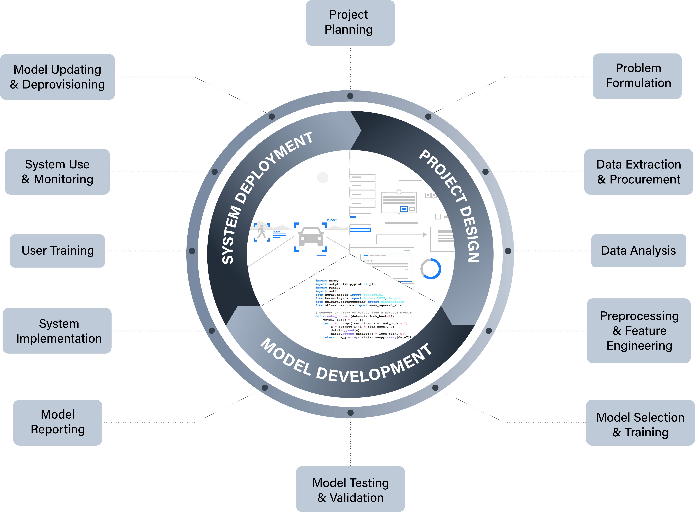
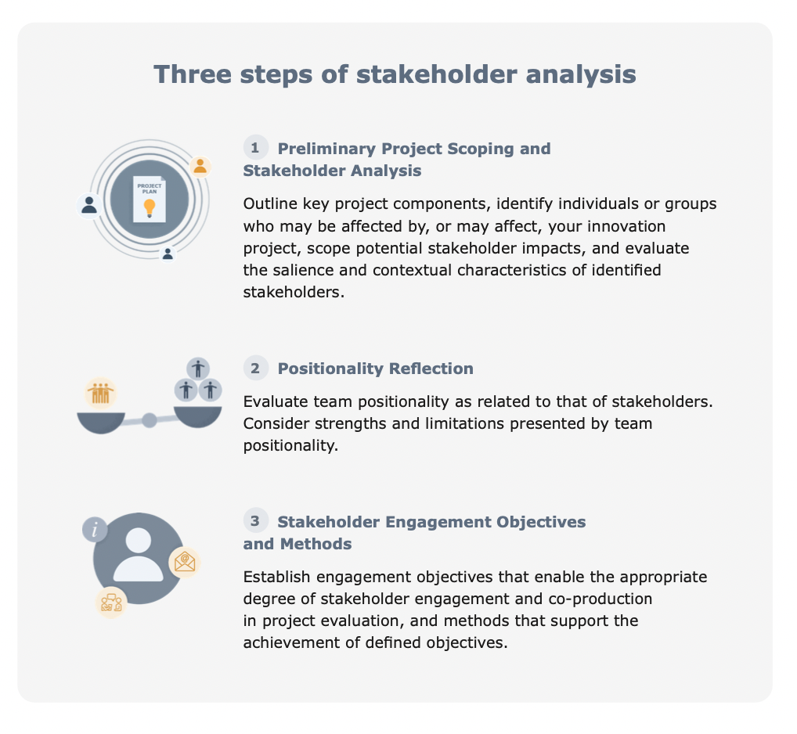
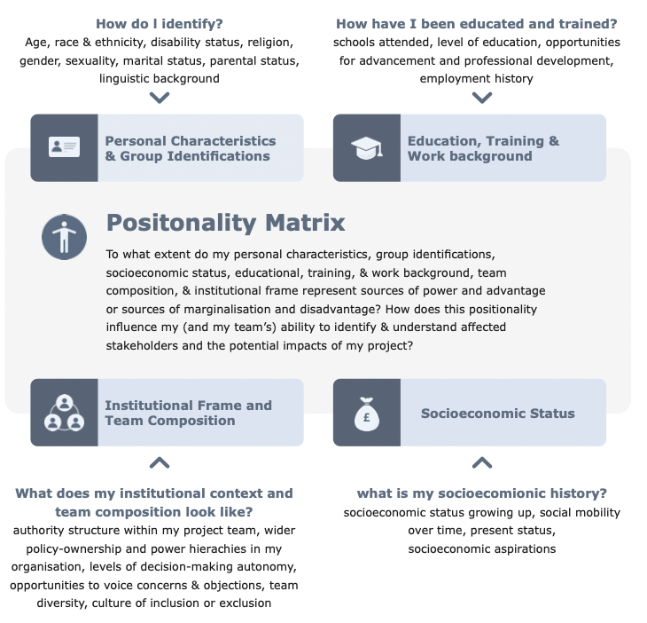
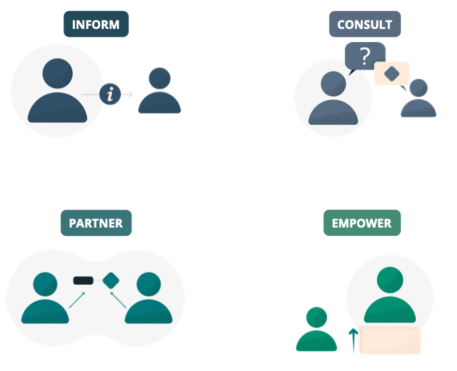

# When should you engage?

A complete answer to the question of *when* you should engage will, ultimately, depend on the specific details of your project.
For instance, if your project involves the collection of experimental data from research subjects, then a significant part of the engagement will likely happen early on in your projects lifecycle.
In contrast, if your project only requires communication of results and findings (e.g., for the goal of increased public awareness), then engagement may happen towards the end.
The goal in this chapter is not to provide an exhaustive list or flowchart that can help you answer the question for any project—this would not be feasible.
Instead, what we will be exploring are two frameworks that can help you answer this question through a series of deliberative processes.

The first of these frameworks is based on a model of a typical ML/AI project lifecycle.
Although most relevant in the context of innovation projects, it can also play a valuable role in research projects, such as those that use ML to support data science.

## The ML/AI Project Lifecycle

A significant portion of modern AI methods are data-driven and rely on various types of machine learning to identify patterns in the data and construct predictive models that can classify, forecast, or optimise goals (among other things).[^symbolic]
As such, data science projects are increasingly turning to machine learning algorithms to help generate knowledge or support scientific processes of discovery (e.g., drug discovery).

[^symbolic]: This is in contrast to symbolic or rules-based methods where a human is required to program the underlying logic that determines the machine's behaviour.

Although a wide range of differences exist between research and innovation projects, the following model is a useful abstraction for reflecting on the typical activities associated with the lifecycle of a project that involves some form of ML or AI.

{ align="center" }

As the above figure demonstrates, we can split a typical project into three over-arching stages:

1. Project Design
2. Model Development
3. System Deployment

'Project Design' comprises those activities that set the foundation for the practical development of the model (e.g., desk-based research, experimental design, data cleaning, exploratory data analysis).

'Model Development' captures the technical processes of building a predictive model, as well as the important process of documenting how it was developed. This is not just important for the reproducibility of science, but is also vital for innovation (e.g. for regulatory compliance).

Finally, 'System Deployment' captures the implementation and use of a model within a sociotechnical system. In the context of a scientific research project, this may include the application of the model to additional datasets to generate insights or knowledge. Whereas in the context of a commercial organisation, this could refer to a wide range of use cases (e.g., recommendation system for online bookings, predictive model for diagnoses in healthcare).

This macroscopic perspective is helpful as a heuristic, but the main benefits of this model for facilitating pubic engagement comes when we look at the lower-level stages.

### Project Design Stages

| Stage | Description | Public Engagement Relevance |
| --- | --- | --- |
| **Project Planning** | Preliminary activities designed to help scope out the aims, objectives, and processes involved with the project, including potential risks and benefits. | May include impact assessment activities designed to identify possible risks to affected users (e.g., safety risks, data privacy violations). |
| **Problem Formulation** | The formulation of a clear statement about the over-arching problem the system or project addresses (e.g., a research statement or system specification) and a lower-level description of the computational procedure that instantiates it. | Clarity on the problem or task being pursued can help a project team whether the system is likely to be socially acceptable prior to engagement (e.g. a facial recognition system deployed in a public space to monitor frequent visitors) |
| **Data Extraction or Procurement** | The design of an experimental method or decisions about data gathering and collection, based on the planning and problem formulation from the previous steps. | Members of the public may have differing views on what data (and the methods by which they are collected) are acceptable to collect. |
| **Data Analysis** | Stages of exploratory and confirmatory data analysis designed to help researchers or developers identify relevant associations between input variables and target variables. | Having an understanding of your data prior to model development can help identify whether groups of stakeholders have been systematically overlooked (i.e. sources of missing data). |

### Model Development Stages

| Stage | Description | Public Engagement Relevance |
| --- | --- | --- |
| **Preprocessing and Feature Engineering** | A process of cleaning, normalising, and refactoring data into the features that will be used in model training and testing, as well as the features that may be used in the final system. | Choices made at this stage can affect the overall interpretability of a model, which can affect how easily users or stakeholders will be able to engage with the final system.|
| **Model Selection and Training** | The selection of a particular algorithm (or multiple algorithms) for training the model. | Choices made at this stage can affect the overall interpretability of a model, which can affect how easily users or stakeholders will be able to engage with the final system. |
| **Model Testing and Validation** | Testing the model against a variety of metrics, which may include those that assess how accurate a model is for different sub-groups of a population. This is important where issues of fairness or equality may arise.  | If a model is more performant for one group than another, this should be discussed with the affected and impacted stakeholders during engagement. |
| **Model Documentation** | A process of documenting both the formal and non-formal properties of both the model and the processes by which it was developed (e.g., source of data, algorithms used, evaluation metrics). | Access to documented evidence can be useful for a wide variety of public engagement goals, including general communication of results to evidence to support deliberative exercises. |

### System Deployment Stages

| Stage | Description | Public Engagement Relevance |
| --- | --- | --- |
| **Model Productionalisation** | The process of putting a model into production. That is, implementing a model within a system that enables and structures interaction with the model (e.g. a recommender system that converts a user's existing movie ratings into recommendations for future watches. | Engaging affected stakeholders can help identify challenges or barriers to productionalisation that have not been anticipated (e.g., approval processes, software compatibility, user experience concerns).|
| **User Training** | Training for those individuals or groups who are either required to operate a data-driven system (perhaps in a safety critical context) or who are likely to use the system (e.g. consumers). | Where a research or innovation project results in a change to existing processes, it is important that the users are engaged in order to ensure that the system is used correctly. Otherwise, its overall efficacy can be significantly impaired. |
| **System Use and Monitoring** | Ongoing monitoring and feedback from the system, either automated or probed, to ensure that issues such as model drift have not affected performance or resulted in harms to individuals or groups.| Ongoing engagement with users and stakeholders can help identify whether the original project's objectives have been met, or if the model/system are still performing as intended. |
| **Model Updating or Deprovisioning** | An algorithmic model that that adapts its behaviour over time or context may require updating or deprovisioning (i.e. removing from the production environment). | If the updating or deprovisioning results in a loss of service—possibly to a business critical system—then users and stakeholders will likely need to be consulted, either to ensure no harms arise or to identify the steps needed to bring a new or revised project to fruition. |

As we will see shortly, the above framework helps establish a common reference point that can anchor reflection and deliberative activities related to public engagement.
The following illustrative example helps to demonstrate this point.

!!! abstract "Shaping Attitudes to Public Policy"

    A group of researchers working for a news organisation are carrying out a project to explore how the political attitudes of members of the public may be influenced by algorithmically generated articles.
    One of their goals is to determine whether the emotional valence of an article affects the likelihood of the reader agreeing with or disagreeing with public policies that are being discussed by the news articles.
    
    Using the AI project lifecycle model, they identify three initial stages and activities during their preliminary project planning:
    
    - Stakeholder identification and engagement to support experimental design (Project Planning)
    - Participant data gathering and informed consent (Data Extraction or Procurement)
    - Experiment and participant feedback (Model Testing and Validation)
    
    However, when they begin the initial stakeholder identification and engagement they hit a roadblock.
    During discussion and deliberation with potential users of the news platform, the research team ask the participants to share their attitudes towards algorithmically generated content.
    A majority of the participants have a critical attitude towards the use of AI to generate news contents, and express strong disapproval of the proposed idea of influencing attitudes towards public policies through what they see as "emotional manipulation".

    On the basis of this feedback, the research team decide to change their research plan by co-designing an alternate system with the participants. The revised system still uses generative AI, but as a decision support for a human journalist. The team also add a further engagement activity during the `model documentation` stage to help mitigate any further aversion towards the system by ensuring sufficient public understanding and awareness of how the system operates.

We will reference this model and its constituent stages repeatedly as we continue through the remainder of the course.

## Stakeholder Analysis

Regardless of the type of engagement, a core part of any public engagement is knowing your audience.

!!! warning "Important"

    Ask "who" before "how"!

This section will explore a three-step process, which begins with 'Project Planning' and is designed to help you identify and understand your audience (or, stakeholders), summarised in the following graphic.

{ width="75%"}

!!! warning "Principle of Proportionality"

    The following steps are designed to be fairly exhaustive.
    Therefore, it is important to recognise that they represent an ideal, which will need to be tailored to the specifics of a research and innovation project.
    In short, some questions or forms of engagement/evidence gathering may not be required for particular research or innovation projects.
    For example, a simple research project focusing on improving data literacy will not require the same types of extensive impact assessments as an innovation project developing a new safety critical AI system for use in healthcare.

### 1 Preliminary Project Scoping and Stakeholder Analysis

The first step occurs within the project team and involves a number of questions or self-assessments that help lay the groundwork for the remainder of the project:

- [x] outline key project components, including
  - [x] a high-level description of the ML/AI system being employed
  - [x] the domain or context of use
  - [x] the data to be used in the project (e.g. for model training)
- [x] identify individuals or groups who may be affected by your project
- [x] identify individuals or groups who may affect your project
- [x] scope potential stakeholder impacts
- [x] evaluate the salience and contextual characteristics of identified stakeholders

The answers and evidence accumulated from answering these questions will help your team with subsequent activities.

### 2 Positionality Reflection

All individual human beings come from unique places, experiences, and life contexts that have shaped their thinking and perspectives.
Reflecting on this variation can help us understand how our viewpoints might differ from those around us, and from those who have diverging cultural and socioeconomic backgrounds and life experiences.

Social scientists have long referred to this kind of self-locating reflection as “positionality.”
When team members take their own positionalities into account, and make this explicit, they can better grasp how the influence of their respective social and cultural positions may affect the engagement process.
The following 'positionality matrix' is designed to help with this process:

{ width="75%"}

An example of how an individual's or group's characteristics may affect a research or innovation project is if a project team fail to identify how their own educational backgrounds enable them to understand and comprehend technical or complex concepts with comparative ease, or how the lack of cultural diversity in the team prevent them from recognising the significance of alternative values (e.g., prioritising technological policies that support social cohesion over individual autonomy). 

### 3 Stakeholder Engagement Objectives and Methods

The final step is to establish *engagement objectives* that enable the appropriate degree of stakeholder engagement and co-production in project evaluation, and *methods* that support the achievement of defined objectives. We will look at the latter of these in detail in the next section, so let's just address the former here.

If we think back to the first chapter, and the different models of participation (e.g., Arnstein's ladder of engagement)[@arnstein1969], then we can identify the following four goals that can help us specify our project's objectives:

{ width="75%" }

The use of these goals to support the identification of engagement objectives should also be informed by a) the following variations on participation, and also b) the methods of participation available to you and those who you are engaging (see [next chapter](how.md))

| Degree of Participation | Description | Means of Participation | Level of Agency |
| --- | --- | --- | --- |
| :material-information: **INFORM**  | Stakeholders are made aware of decisions and developments.    | External input is not sought out. Information flows in one direction. This an be done through newsletters, the post, app notifications or community forums. | :material-battery-low: `LOW` Stakeholders are considered information subjects rather than active agents.|
| :octicons-comment-discussion-16: **CONSULT** | Stakeholders can voice their views on pre-determined areas of focus, which are considered in decision-making. | Engagement occurs through online surveys or short phone interviews, door-to- door or in public spaces. Broader listening events can support consultations. | :material-battery-low: `LOW` Stakeholders are included as sources of information input under narrow, highly controlled conditions of participation.|
| :material-handshake: **PARTNER** | Stakeholders and teams share agency over the determination of areas of focus and decision making. | External input is sought out for collaboration and co- production. Stakeholders are collaborators in projects. They are engaged trough focus groups. | :material-battery-medium: `MODERATE`  Stakeholders exercise a moderate level of agency in helping to set agendas through collaborative decision making.|
| :material-podium: **EMPOWER**  | Stakeholders are engaged with as decision-makers and are expected to gather pertinent information and be proactive in co-operation.| Co-production exercises occur through citizens’ juries, citizens’ assemblies, and participatory co-design. Teams provide support for stakeholders’ decision making. | :material-battery-high: `HIGH` Stakeholders exercise a high level of agency and control over agenda-setting and decision making.|
