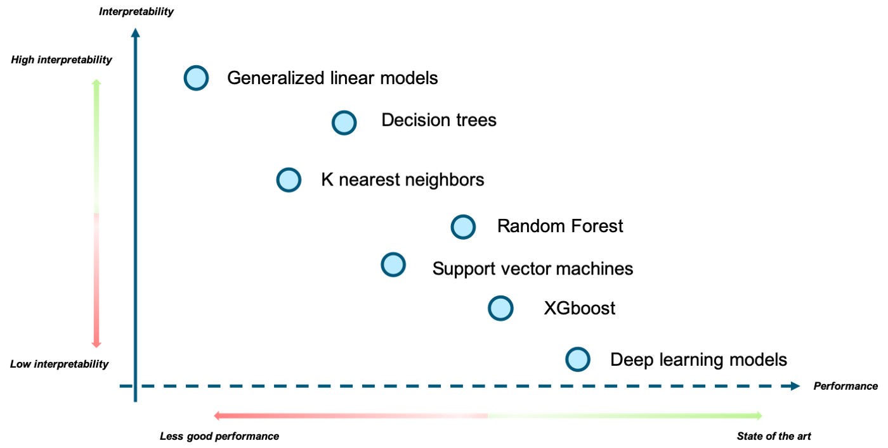
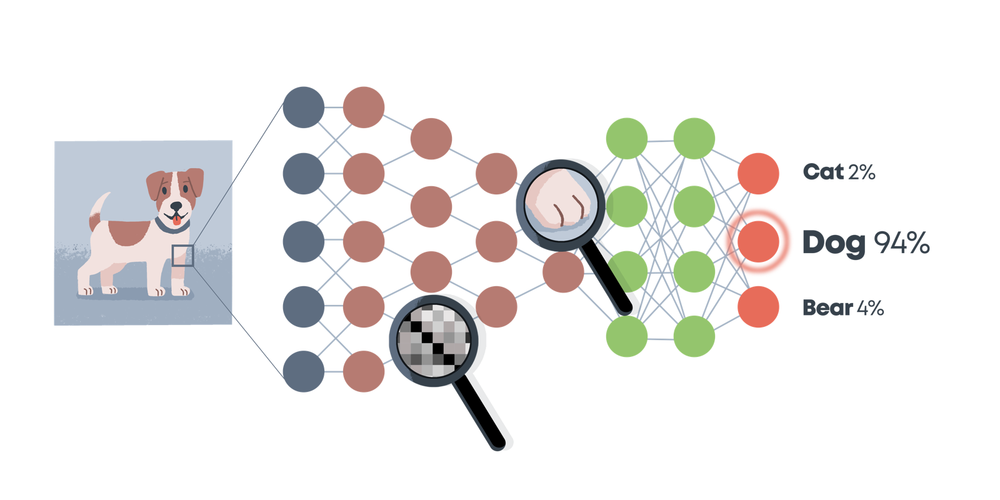

# Model Selection

This stage determines the model type and structure that will be produced in the next stages.
In some projects, model selection will result in multiple models for the purpose of comparison based on some performance metric (e.g. accuracy).
In other projects, there may be a need to first of all implement a pre-existing set of formal models into code.
The class of relevant learning algorithms used to train the model is likely to have been highly constrained by many of the previous stages (e.g. available resources and skills, problem formulation).
For example, where the problem demands a supervised learning algorithm, instead of an unsupervised learning algorithm, to help develop a model that can predict likely values for future instances not contained within the original dataset.

## Interpretability

While accuracy or predictive power may be typical goals that motivate the selection of specific learning algorithms and models (see [below](#some-common-algorithms)), there are also additional factors that can influence decision-making.
One notable factor is the inherent interpretability of the model.

Certain learning algorithms produce models that are inherently less interpretable than others.
For instance, a linear regression model is easy to understand because of the straightforward connection between input variables and the learned weights that alter how much influence the individual variables have on the outputs.
However, a neural network, at the other end of the extreme is often described as a ''black box model" because the relationship between the input features and the output is often too difficult to interpret without the use of ad hoc methods[@ico2020].
The trade-off for this lower interpretability can be greater performance in terms of accuracy or predictive power.

<figure markdown>
  { align="center" }
  <figcaption>A schematic showing the trade-off between model interpretability and model performance. Reprinted from <a href="https://towardsdatascience.com/explainable-ai-the-data-scientists-new-challenge-f7cac935a5b4"> (Diop, 2019)</a></figcaption>
</figure>

This trade-off has important normative considerations though.
For instance, consider the decision to deploy an algorithmic decision support system in criminal courts to help a judge decide on a sentence.
A more accurate model could reduce the number of unfair decisions (e.g., someone being given a prison sentence rather than community service), but the judge may not be able to understand why a particular decision is recommend by the model and thus be unable to explain their decision to the defendant.
As transparency and accessibility are vital parts of judicial decision-making and the rule of law, the use of a black-box model, in spite of the greater accuracy, may be deemed unlawful and unjust.[@bingham2011]
The trade-off is in almost all non-trivial cases, unavoidable.
Therefore, such a decision is inescapably value-laden and inherently about exercising ethical reflection and responsible deliberation—likely in conjunction with [affected stakeholders](../project_design/planning.md).

## Some Common Algorithms

### Supervised Learning

<figure markdown>
  { align="center" }
  <figcaption>An illustration of a neural network classifying an image of a dog correctly.</figcaption>
</figure>

Supervised learning involves training a model using a set of examples, which are pairs of input data and corresponding labels.
For example, learning to classify labelled images as pictures of 'cats' or 'dogs', in order to then classify new (unlabelled) instances.
Formally, the algorithm takes a set of $n$ pairs, ${(x_1,y_1),...,(x_n,y_n)}$, where $x_i$ is the feature vector of the $i$-th example and $y_i$ is its label.
The task of the learning algorithm is to learn a function that maps members of the input space $X$ onto the output space $Y$.

Supervised learning algorithms can be used to perform classification or regression tasks.
Commonly used learning algorithms include:

- [Linear Regression](https://developers.google.com/machine-learning/glossary#linear-regression)
- [Logistic Regression](https://developers.google.com/machine-learning/glossary#logistic-regression)
- [Naive Bayes](https://en.wikipedia.org/wiki/Naive_Bayes_classifier)
- [Decision Trees](https://developers.google.com/machine-learning/glossary#decision-tree)
- [Support-Vector Machines](https://en.wikipedia.org/wiki/Support-vector_machine)
- [Neural Networks](https://en.wikipedia.org/wiki/Neural_network)

<!-- 

 -->

### Unsupervised Learning

In contrast, unsupervised learning algorithms try to find patterns in unlabelled data, typically by clustering the data into similar groups or reducing the dimensionality of the variables (or, features) under consideration. For example, an algorithm may try to cluster shoppers into groups based on their purchasing habits. A human would then need to interpret the meaning behind this clustering.

Commonly used unsupervised learning algorithms include:

- [K-Means Clustering](https://developers.google.com/machine-learning/glossary#k-means)
- [Hierarchical Clustering](https://developers.google.com/machine-learning/glossary#hierarchical-clustering)
- [Support Vector Clustering](https://en.wikipedia.org/wiki/Support-vector_machine)
- [Principal Component Analysis](https://en.wikipedia.org/wiki/Principal_component_analysis)

### Reinforcement Learning

Finally, we have reinforcement learning (RL). RL algorithms try to learn an optimal policy that has the goal of maximising some value function when interacting within a particular environment. For example, an intelligent agent that has the goal of scoring the highest number of points in a video game by learning what actions to perform in response to visual feedback from a screen.

RL algorithms can be split into *model-free* or *model-based* methods, where the latter tries to build a model of its environment on which to choose the optimal policy.[@ai2019]
