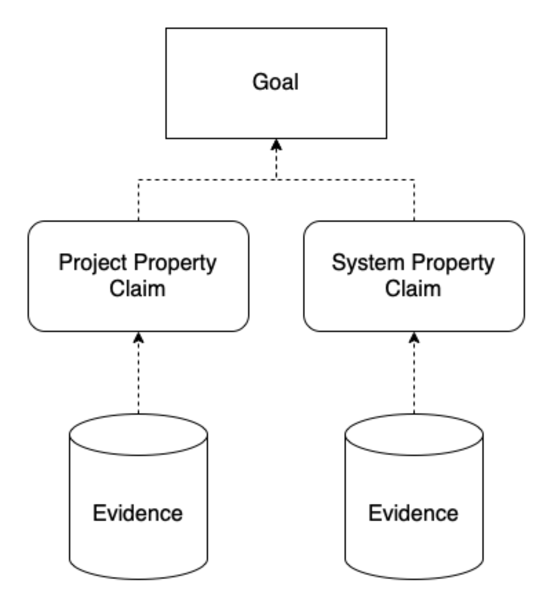
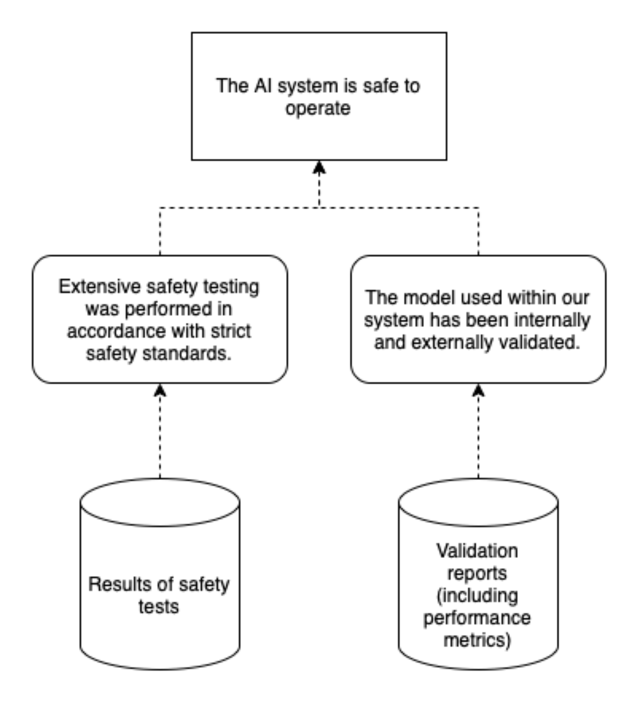

# What is Argument-Based Assurance?

!!! note "Reference"

    This section is based on Burr[@burr2021], which provides a more thorough account of the argument-based assurance methodology and how it applies to responsible research and innovation in data science and AI.

The method we will explore that serves the role of facilitating responsible communication is known as *argument-based assurance* (ABA).
We can define ABA as:

> a process of using structured argumentation to provide assurance to another party (or parties) that a particular claim (or set of related claims) about a property of a system is warranted given the available evidence.

As a structured method for communication, ABA is already widely used in safety-critical domains or industries where manufacturing and development processes are required to comply with strict regulatory standards and support industry-recognised best practices.[@hawkins2021]

However, ABA is useful for more than just demonstrating regulatory compliance.
It can also

- assist internal **reflection** and **deliberation** by providing a systematic and structured means for evaluating how the development of systems or products can fulfil certain normative goals (e.g. safety or robustness), according to certain well-defined properties (e.g. software hazards identified) and criteria (e.g. risk reduction thresholds met);
- provide a deliberate means for the **anticipation** and **pre-emption** of potential risks and adverse impacts through mechanisms of end-to-end assessment and redress;
- facilitate **transparent communication** between developers and affected stakeholders;
- support mechanisms and processes of **documentation** (or, reporting) to **ensure accountability** (e.g. audits, compliance);
- and build **trust and confidence** by promoting the adoption of best practices (e.g. standards for warranted evidence) and by conveying the integration of these into design, development, and deployment lifecycles to impacted stakeholders.

For these reasons, it is a useful foundation upon which to build a framework for responsible communication.

## Assurance Cases

When a barrister stands in a court room, in front of the judge, jury, and defendant, they are tasked with presenting a case.
If they are part of the prosecution, their role is to convince the jury, beyond all reasonable doubt, that the defendant is guilty of committing the crimes of which they stand accused, based on the admissible evidence agreed upon by all parties.
The case they present, therefore, is an argument that attempts to justify their position or standpoint.
Although the format and goals may be different, the purpose of **argument-based** assurance is also to develop and present a case.
This is not an argument in the antagonistic sense of the term, but rather a structured and justifiable case supported by evidence.

The scope and content of what we can call an 'assurance case' is determined by the relevant details of the project in question, and what the project team need to provide assurance for. For example, if a project team needs to communicate the processes by which they have ensured the *interpretability* of their model, they may need to develop an *interpretability case*, which could look something like the following:

![A template of an assurance case that focuses on providing assurance for the interpretability of a machine learning model. Reprinted from Ward[@ward2020]](../../assets/images/graphics/interpretability-case.png)

Here, the assurance case is represented in a graphical format.
The top-level claim is a goal that is supported by the lower level claims, which in turn further specify what it means to say "The {ML model} is sufficiently {interpretable} in the intended {context}".
At the lowest level is the evidence that supports and establishes the relevant basis for making the specific claims.
Overall, the case is a *structured argument* that is oriented towards the top-level goal.

This is achieved by first *reflecting* on what the goal claim means.
For instance, what are the parameters of *sufficiently interpretable*?
Or, what is the *intended context*?

Next, the project team consider the *actions* they have taken that can be referred to as supporting *evidence*.
This evidence provides the inferential support for the higher-level claims.

Finally, once all the pieces are together in a structured manner, the entire case is used as the basis for *justifying* the validity of the top-level goal.

### Elements of an Assurance Case

The interpretability example helps us identify a *minimal set* of elements that need to be established in an assurance case:

1. A top-level normative goal
2. Claims about the project or system
3. Supporting evidence

The top-level goal orients and delineates the case by setting a direction and helping to establish the scope of what claims need to be included.
For instance, a particular claim about the privacy or security of a project's data management policy many be important but unnecessary to include in an assurance case that justifies why a model does not cause any discriminatory harm.

In addition to any clarificatory claims that pertain to the goal (e.g., what type of model is being assured; the context of use for the system), the lower-level claims should further specify the goal by a) addressing the specific activities that have been carried out during the project, or b) identifying properties of the system that help ensure the goal claim is legitimate.
We can, therefore, separate the type of lower-level claim being established as either a *project* or *system* property claim.

Unless the claim is self-evidential, there will need to be a final element that points to some supporting evidence.
This evidence establishes the foundation upon which the justifiability of the overall argument depends.
The following two figures show the relationship between these elements and also provide an example of a partial assurance case that focuses on a goal of safety.

=== "Figure A"

    
    A minimal set of elements for an assurance case.

=== "Figure B"

    
    An example of a goal, claims, and evidence using the minimal set of elements identified previously.

### Who is the Target Audience?

As you can probably imagine, all of these elements help play a vital role in the effective communication of an assurance case.
A clear goal helps signal to stakeholders what values underwrite and motivate your project, as well as providing the means for more critical evaluation and engagement (i.e. an assessment by the stakeholders of whether your goal has been obtained, conditional on the evidence provided).
The set of claims collectively establishes the scope and content of your argument, enabling stakeholders to identify whether there are any gaps (i.e. whether your argument is complete).
And, the evidential base allows stakeholders to determine whether there is a legitimate reason for accepting your argument.

However, the justifiability and acceptability of an assurance case, in part, depends on the target audience.
Sticking with the interpretability example, we can note that what is interpretable to an expert in statistical learning theory may be completely uninterpretable for a policy-maker tasked with evaluating whether a particular model is suitable to deploy in their own project.
Therefore, prior to building an assurance case, it is important to identify the target audience and understand their needs.
In some cases, this may be determined on the behalf of the project team (e.g. where an external auditor requests assurance for compliance objectives).
In other cases, identifying relevant stakeholders may have been performed through stakeholder engagement processes carried out as part of the '[Project Planning](../chapter3/project_design/planning.md)' activities.

## Reflect, Act, Justify

We now have sufficient background information to present an intuitive (high-level) procedure for developing and communicating an assurance case.
The procedure is broken down into three steps, which also complement the goals of the [project lifecycle](../chapter2/project_lifecycle.md):

1. Reflect
2. Act
3. Justify

**Reflection** is an anticipatory and deliberative process in which questions such as the following are asked of the project and its governance:

1. What are the goals of your system?
2. How are these goals defined?
3. Which stakeholders have participated in the identification and defining of these goals?
4. What properties need to be implemented in the project or system to ensure that these goals are achieved?
5. Which actions ought to be taken to establish these properties within the project or system?

These are inherently normative and value-laden questions, which is one reason why diverse and inclusive stakeholder engagement is so crucial.

**Action** occurs throughout all of the stages of the project lifecycle, and the output of many of these actions are likely to serve as the evidence for the claims of the assurance case.
These actions and evidential artefacts can also help you identify what claims may be relevant in your argument.
As such, the following questions serve only to provide some additional supporting structure to this process:

1. What actions have been undertaken during **(project) design** that have generated salient evidence for your goals and claims?
2. What actions have been undertaken during **(model) development** that have generated salient evidence for your goals and claims?
3. What actions have been undertaken during **(system) deployment** that have generated salient evidence for your goals and claims?

Using the project lifecycle model as a scaffold or guide is, therefore, a useful tool for both a) reflectively planning the necessary activities that ought to be undertaken, prior to the project's commencement, and b) evaluating and assessing whether there are any gaps as a project evolves.

The final step is to **justify** that your evidence base is sufficient to warrant the claims that are being made about the properties of your project or system.
This does not mean that the assurance case is the final activity that needs to be done at the very end of a project.
Rather, it's development should be seen as iterative and ongoing as the project evolves.
Identifying the relevant evidence and determining whether the evidence base is sufficient and complete can be challenging. 
To help this process, deliberative prompts such as the following can be instructive:

1. Which stakeholders, identified in your stakeholder engagement plan, can support the evaluation of your evidence and overall case?
2. Is any evidence missing from your case?
3. Are the collection of property claims jointly sufficient to support your top-level goal?

However, in general stakeholder engagement—especially with domain experts—is essential.

In the next section, we will discuss some possible orienting goals and principles, to help you identify the sorts of properties that may comprise an ethical and responsible assurance case.
