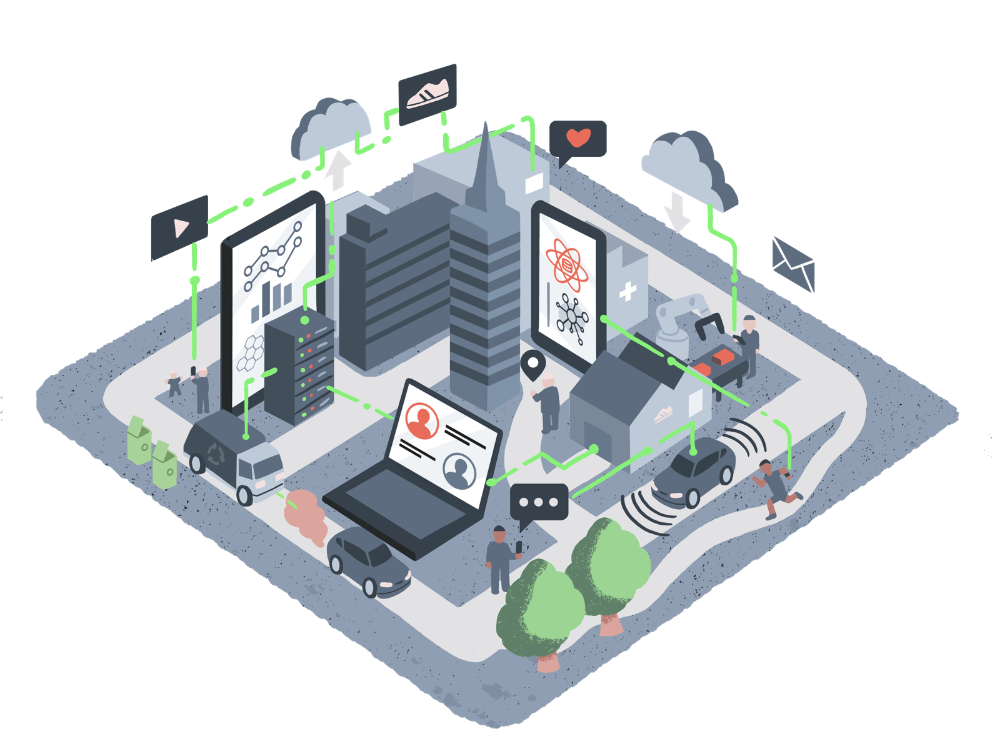

<figure markdown>
  { align="center" }
  <figcaption>Illustration by [Johnny Lighthands](https://www.johnnylighthands.co.uk))</figcaption>
</figure>

# 6 Conclusion (Looking Forward)

At the start of this guidebook, several learning objectives were presented.
They were to:

- Understand what is meant by the term ‘responsible research and innovation’, including the motivation and historical context for its increasing relevance.
- Identify and evaluate the ethical issues associated with the key stages of a typical data science or AI project lifecycle: (project) design, (model) development, (system) deployment.
- Explore practical tools and mechanisms for operationalising the concept of ‘responsibility’ within the context of data science and AI research and innovation.
- Gain an appreciation of shared goals and values across scientific disciplines and research domains through dialogue with other participants.

By now, you should be in a position to determine whether these objectives have been met.
You should also be in a better position to critically evaluate the material that has been presented, and to ask how well it meets these objectives.
I encourage you to be critical!

There is no shrinking away from the fact that this guidebook, unsurprisingly, has gaps and limitations.
As such, there is plenty of room for improvement.
This is one of the reasons why it is linked to a GitHub repository.
Hopefully, others can contribute to its development and a community of interested participants can help improve the content to make it more useful for future visitors—a true *commons* for those that care about ensuring data science and AI work for the benefit of society.
There is one limitation that is worth highlighting though.

At the time of writing this (November 2021), there is a lot of research underway in an area known as 'intercultural ethics',[@evanoff2020] with a specific focus on how it applies to data science and AI.[^intercultural]
Much of this research explores how different normative values are represented and accommodated—or, conversely poorly represented and accommodated—in the design, development, and deployment of data-driven technologies.
Because many technological systems or models are deployed in global and multicultural environments, there is a significant concern about the extent to which those values embedded into a system by its developers come into tension or conflict with different communities across the globe.
Moreover, as these technologies are "data-driven", there are also concerns about the degree to which marginalised or vulnerable communities across the globe are empowered to use or take control of how their data is managed.
These issues are not well represented in the current version of this guidebook.

[^intercultural]: See the special issue by Aggarwal[@aggarwal2020].

One reason for this is simply that there are two other guidebooks—one on AI Ethics & Governance, and one on Public Engagement and Communication of Science—for which these topics are more directly relevant.
However, while these guidebooks are better suited to dealing with these topics directly, that does not preclude this guidebook from integrating some of the lessons about intercultural ethics or data justice into the current chapters.
Therefore, subsequent iterations of this guidebook will aim to engage this literature more directly.
In the meantime, the 'Further Reading' section has some starting points and references for those who may be interested.

## Taking Responsibility

A core focus of this guidebook has been the idea that science and technology are inextricably interconnected with society, and help shape its norms and practices.
In this context, the anticipatory and reflective elements of [UKRI's **AR**EA framework](https://epsrc.ukri.org/research/framework/area/), are about looking forward into the future and trying to take responsibility for the impact of the research or innovation that you have some direct control over.
Doing this, presupposes a vital ethical value that is overlooked by the AREA framework: an attitude or disposition to *care* for others and the society in which you arte situated. As Leslie[@leslie2020] notes, this changes the AREA framework into a CARE and Act framework.

Taking responsibility, therefore, is a reflection of your values and a reflection of what you choose to care about.
By taking responsibility for your research and innovation you are helping to care for society and the future we will share.

Thanks for taking part 🙏
